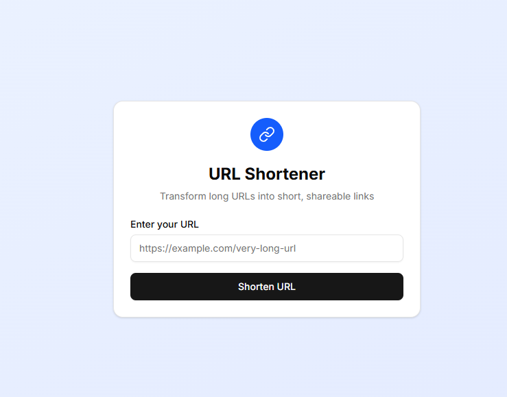

# URL Shortener

Transform long URLs into short, shareable links

For more screenshots observe `./.screenshots` directory

## Features

- Generate unique short links for any URL
- Error handling for cases when URL is invalid or URL generation has failed
- Simple responsive design

## Tech stack

- NextJS + Server Actions
- Postgresql + Drizzle
- Radix + Shadcn
- Docker + docker compose

## Installation

- Run `nvm install && nvm use`
- Run `npm install`

## Development

- Run `cp .env.example .env`
- Run `docker compose up -d`
- Run `npm run dev`

## Production

For production use `Dockerfile`
